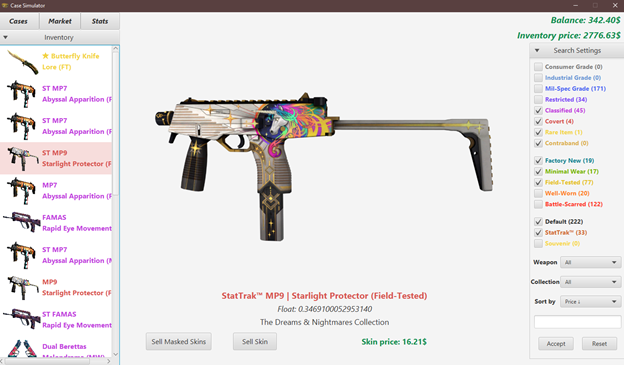

# Case Simulator: Симулятор открытия кейсов CS:GO  

## Описание проекта
Это реалистичный симулятор открытия кейсов из CS:GO, разработанный для любителей виртуального азарта.  
В отличие от большинства симуляторов, Case Simulator использует **реальные шансы выпадения предметов**, **вычисление флота выпавшего скина** и пр., что делает процесс максимально приближённым к оригинальной игре.  

В приложении доступны:  
- Точные копии кейсов из CS:GO с реальными скинами и шансами выпадения дропа.  
- Поддержка всех степеней износа скинов и редкостей.  
- 3 вкладки:  
  - **Кейсы** — открывайте кейсы и собирайте редкие скины.  
  - **Инвентарь** — управляйте своей коллекцией, продавайте или осматривайте скины.  
  - **Маркет** — покупайте желаемые скины.  

## Основной функционал  
1. **Кейсы:**  
   - Выбор кейса из доступных.  
   - Возможность просмотреть, что может выпасть (по кнопке «Просмотр содержимого»).  
   - Реалистичный процесс выпадения предметов с возможностью принять дроп в инвентарь или сразу продать.  
   - Поиск кейсов по названию или типу (кейсы/сувенирные наборы).  

2. **Инвентарь:**  
   - Список всех полученных скинов.  
   - Сортировка по:  
     - **Флоту** (степень износа).  
     - **Цене.**  
     - **Редкости.**  
   - Фильтрация по:  
     - Типу оружия.  
     - Степени износа.  
     - Редкости.  
     - Статусам (обычный/StatTrak/сувенирный).  
   - Возможность осмотреть скин в увеличенном виде.  
   - Продажа скинов.  

3. **Маркет:**  
   - Покупка скинов.  
   - Поддержка тех же функций сортировки и фильтрации, что и в инвентаре.  

## Визуализация  
Каждый скин имеет:  
- **Превью-изображение** для отображения в списках.  
- **Полноразмерное изображение** для каждой степени износа, отображаемое при осмотре или выпадении.   

## Технологии  
- **Язык программирования:** Java  
- **GUI-фреймворк:** JavaFX   

## Описание для пользователей  
**Case Simulator** разработан для тех, кто любит открывать кейсы в CS:GO, но хочет делать это без финансовых затрат. Приложение предлагает продвинутую систему сортировки и фильтрации, что позволяет удобно управлять своей виртуальной коллекцией.  

---
